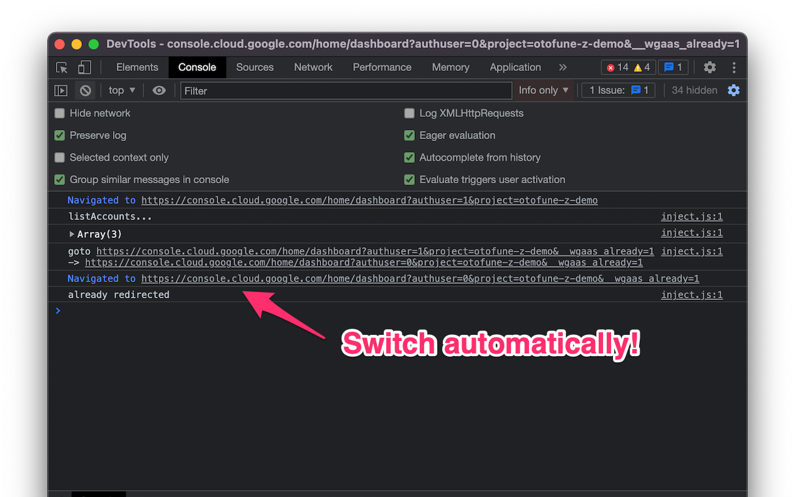

Auto Account Switcher for Google Cloud :chopsticks:
===

Automatic switch to appropriate account based on authority of the project

Installation
---

Currently not available in extension stores.

Please build or unpack develop release from [GitHub Releases](https://github.com/otofune/webext-auto-account-switcher-for-gcloud/releases) and load it.

How to build
---

Just run `yarn build`! Built files are in dist directory.

To load, see below guides.
- Chrome: Load unpacked https://developer.chrome.com/docs/extensions/mv3/getstarted/
- Firefox: Load Temporary Add-on https://developer.mozilla.org/en-US/docs/Mozilla/Add-ons/WebExtensions/Your_first_WebExtension#installing

License
---

Unless otherwise noted, MIT (c) otofune. See [LICENSE](./LICENSE)

### Assets

Assets are designed by [Freepik](https://www.flaticon.com/authors/freepik) from [Flaticon](https://www.flaticon.com). See [LICENSE-flaticon.pdf](./LICENSE-flaticon.pdf).
